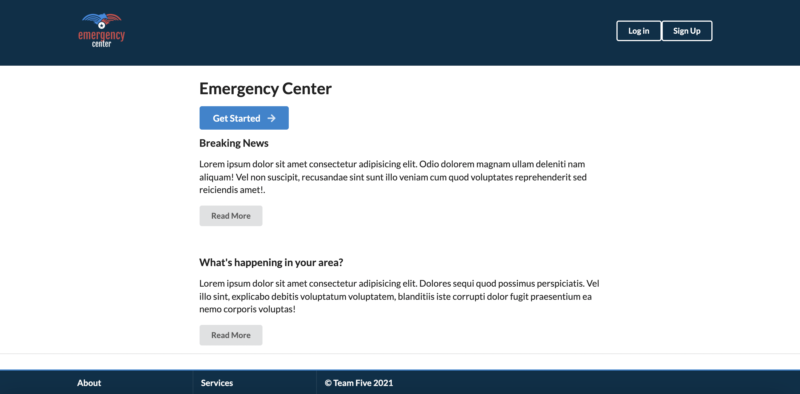

# Emergency-Center

#### Table of Contents
* [Description](#description)
* [Links](#links)
* [Technologies](#technologies)
* [Dependencies](#dependencies)
* [Credits](#credits)

## Description

Emergency Center app is a forum for disaster and emergency incidents. You can view incidents that are reported for or near your current location. Sign-up to report first-hand accounts of the disaster or comment on posts to update the incident and add more information.

Choose an avatar to display on your comments and posts on sign up.

## Links
Deployed at: Heroku link TBD

Repository at: https://github.com/flowingcityloy/Emergency-Center

Report issues: https://github.com/flowingcityloy/Emergency-Center/issues 

## Technologies
This app is uses Express.js to store a MySQL database of posts, users and comments. We use Heroku as our runtime environment for our server. 

### Design
Semantic UI framework

## Node Dependencies
* axios
* bcrypt
* connect-session-sequelize
* dotenv
* express
* express-handlebars
* express-session
* mysql2
* node-fetch
* sequelize
* twilio

## Credits
David Barron
Robyn Graham
Joe Magannom
Lydia Loy
    

